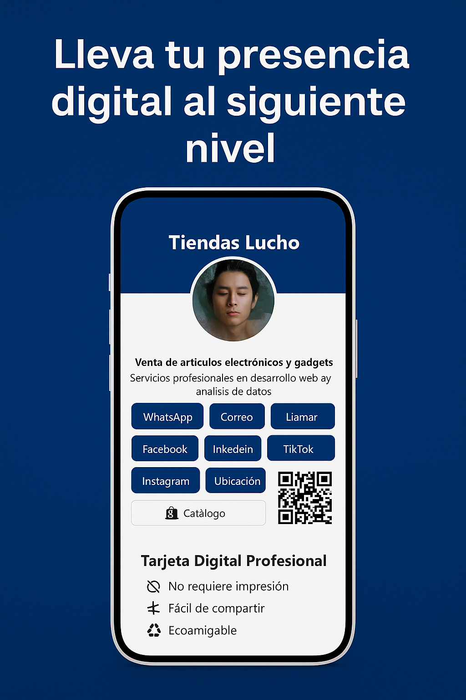

# 💼 Tarjeta Digital Profesional — Tiendas Lucho

**Tarjeta digital responsive en HTML/CSS** diseñada especialmente para emprendedores, negocios locales y profesionales que desean compartir su información de forma rápida, elegante y eficaz desde cualquier dispositivo (móvil, tablet o computadora).

---

## 🚀 ¿Qué es esto?

Una **tarjeta digital personalizable** que puedes alojar en tu propio dominio, en GitHub Pages o en cualquier servidor web. Incluye todos los elementos esenciales para que tu cliente o prospecto te contacte con solo un clic.

---

## ✨ Características principales

- ✅ **Diseño responsive y moderno** (móvil, tablet y PC).
- ✅ **Avatar o logo circular** del titular o negocio.
- ✅ **Encabezado con nombre de la marca o empresa.**
- ✅ **Botones de contacto directo**:
  - WhatsApp con click directo 📱
  - Correo electrónico ✉️
  - Llamada 📞
  - Redes sociales: Facebook, Instagram, TikTok, LinkedIn
  - Ubicación en Google Maps 📍
  - Catálogo o página web externa 🛍️
- ✅ **Formulario de contacto integrado** (envío por correo vía `mailto:`).
- ✅ **Código QR dinámico** para compartir fácilmente la tarjeta.
- ✅ **Sección de servicios** o descripción de tu propuesta de valor.
- ✅ **Mensajes visuales de impacto**: ecoamigable, sin necesidad de impresión, siempre actualizada.

---

## 🧱 Estructura del proyecto

```
tiendas-lucho/
├── index.html              # Página principal
├── css/
│   └── style.css           # Estilos personalizados
├── img/
│   └── (avatar o logo)     # Carpeta para imágenes personalizadas
├── js/
│   └── (opcional)          # Carpeta lista para scripts interactivos
```

---

## 📷 Vista previa



---

## 🌐 Cómo usar esta tarjeta

1. Descarga el repositorio o clónalo:
   ```bash
   git clone https://github.com/tu-usuario/tiendas-lucho.git
   ```

2. Abre `index.html` en tu navegador para ver la demo local.

3. Personaliza los datos:
   - Nombre, logo, links de contacto, descripción y colores.

4. Súbelo a:
   - GitHub Pages
   - Netlify / Vercel
   - Tu propio dominio o servidor de hosting

---

## 💡 Ideal para

- Profesionales independientes y freelancers
- Negocios locales o tiendas físicas
- Startups y emprendimientos digitales
- Promoción de servicios por WhatsApp Business, Instagram Bio, firmas de correo y más

---

## 📈 Beneficios

- ✅ Mejora tu imagen profesional
- ✅ Aumenta el alcance de tus servicios
- ✅ Comparte tu contacto en segundos
- ✅ Ahorra en impresión y papelería
- ✅ Compatible con SEO y marketing digital

---

## 📬 ¿Deseas una versión personalizada?

Puedes contactarme para generar una tarjeta digital única para tu marca. También se ofrecen versiones avanzadas con:
- Formularios dinámicos (con backend en Google Sheets o PHP)
- Base de datos de contactos
- Integración con APIs de WhatsApp Business, Calendly, etc.

---

## 🧑‍💻 Autor

Desarrollado por **Tiendas Lucho**  
📧 [tiendaslucho@gmail.com](mailto:tiendaslucho@gmail.com)  
<!-- 🌐 [https://luchoservicios.com](https://luchoservicios.com) -->

[](https://wa.me/59172698986)
[+591 72698986](https://wa.me/59172698986)
